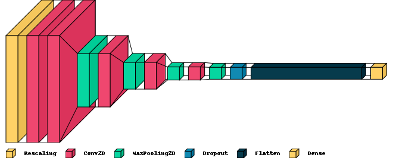
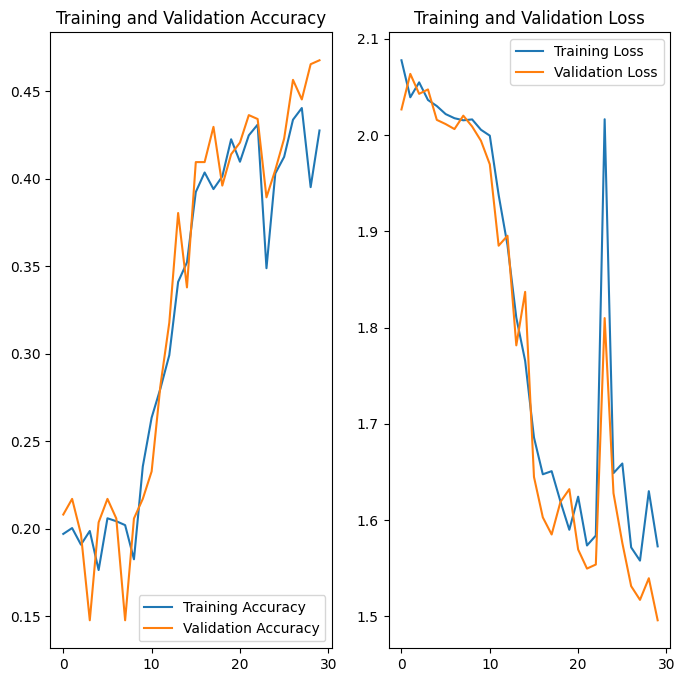

# Melanoma Detection using CNN
To build a CNN based model which can accurately detect melanoma. 

Melanoma is a type of cancer that can be deadly if not detected early. 

It accounts for 75% of skin cancer deaths. A solution that can evaluate images and alert dermatologists about the presence of melanoma has the potential to reduce a lot of manual effort needed in diagnosis.

Here is a visualization of the final model.  More details can be found in the [project pipeline](#project-pipeline)

## Table of Contents
* [General Info](#general-information)
* [Technologies Used](#technologies-used)
* [Conclusions](#conclusions)
* [Acknowledgements](#acknowledgements)

<!-- You can include any other section that is pertinent to your problem -->

## General Information
To detect Melanoma, we use ISIC data set and build a CNN with multiple layers, dropouts.  We also augment the data with some techniques.

The dataset consists of 2357 images of malignant and benign oncological diseases, which were formed from the International Skin Imaging Collaboration (ISIC). 

All images were sorted according to the classification taken with ISIC, and all subsets were divided into the same number of images, with the exception of melanomas and moles, whose images are slightly dominant.

The data set contains the following diseases:

- Actinic keratosis
- Basal cell carcinoma
- Dermatofibroma
- Melanoma
- Nevus
- Pigmented benign keratosis
- Seborrheic keratosis
- Squamous cell carcinoma
- Vascular lesion

### Project Pipeline

- **Data Reading** → Defined the path for train and test images
- **Dataset Creation** → Created train & validation dataset from the train directory with a batch size of 32. Made sure images are resized to 180*180
- **Dataset visualisation** → Created a code to visualize one instance of all the nine classes present in the dataset
- **Model Building & training** → 
   - Created a CNN model, which can accurately detect 9 classes present in the dataset. While building the model, rescale images to normalize pixel values between (0,1).
   - Chose an appropriate optimiser and loss function for model training
   - Trained the model for ~30 epochs
   - Wrote the findings after the model fit. Checked for overfitting and underfitting
   - Visual representation of the first model given below

- **Data Augmentation** → Chose an appropriate data augmentation strategy to resolve underfitting/overfitting
- **Model Building & training on the augmented data** →
  - Created a CNN model, which can accurately detect 9 classes present in the dataset. While building the model rescaled images to normalize pixel values between (0,1).
  - Chose an appropriate optimiser and loss function for model training
  - Trained the model for ~30 epochs
  - Wrote the findings after the model fit, and commented whether the overfitting and underfitting is fixed or not
  - Visual representation of the model used to train on sample augmented data is given below

- **Class distribution** → Examined the current class distribution in the training dataset 
   - Which class has the least number of samples? **Seaborrheic keratosis least number of samples**
   - Which classes dominate the data in terms of the proportionate number of samples? **Melanoma, pigmented benign keratosis and basal cell carcinoma dominate the samples**
- **Handling class imbalances** → Rectified class imbalances present in the training dataset with Augmentor library.
- **Model Building & training on the rectified class imbalance data** →
  - Created a CNN model, which can accurately detect 9 classes present in the dataset. While building the model, rescale images to normalize pixel values between (0,1).
  - Chose an appropriate optimiser and loss function for model training
  - Trained the model for ~50 epochs
  - Wrote the findings after the model fit, the overfitting was fixed and the accuracy improved
  - Visual representation of the **final model** used to train on sample augmented data is given below

## Conclusions
- **Original Model**: The first model was overfitting and it could be visible in the training and validation accuracies.

- **Improved Accuracy with Augmentor Library**: The application of the Augmentor library for image augmentation has led to a significant improvement in the model's accuracy on the training data. By creating varied versions of existing images, the model has been exposed to a broader range of data, enhancing its ability to generalize and thus boosting its performance.
- **Proof of concept - Data Augmentation**: With data augmentation we could see that the overfitting was being reduced.  We looked at random flip, random rotation & random zoom.  It is evident from the training & validation accuracies that we are on the right track.  Even though the overall accuracy decreased, overfitting also reduced significantly.

- **Overfitting Reduced**: The issue of overfitting, where the model performs well on the training data but poorly on unseen data, has been significantly reduced. This improvement is evident from the fact that the model's accuracy on the validation data is reasonably close to its accuracy on the training data.
- **Dropout Layer Effectiveness**: The addition of dropout layers to the neural network has proven effective in combating overfitting. Dropout layers work by randomly setting a fraction of input units to 0 during each update in the training phase, which helps in making the model less sensitive to specific weights of neurons, thereby improving its ability to generalize.
- **Training and Validation Loss**: Both the training and validation loss are decreasing, indicating that the model is learning from the training data and generalizing well to unseen data. The validation loss is decreasing at a slower rate than the training loss, which is expected as the model is not learning directly from the validation data.
- **Potential for Further Improvement**: Despite the improvements made, there is still potential for further enhancing the model's performance. This could be achieved through hyperparameter tuning, which involves adjusting parameters like the learning rate, batch size, number of layers, and number of neurons in each layer. By finding the optimal configuration for these parameters, the model's performance on both the training and validation data can be maximized.

The final model has shown good accuracies on both the training and validation data.  It should fare well as a first model that can be further tuned.

## Technologies Used
- library - version 1.0
- library - version 2.0
- library - version 3.0

## Acknowledgements
I give credit to my wife for putting up with all the hardships as I spend time to finish the assignments

## Contact
Created by - [harish-babu](https://github.com/harish-babu)

